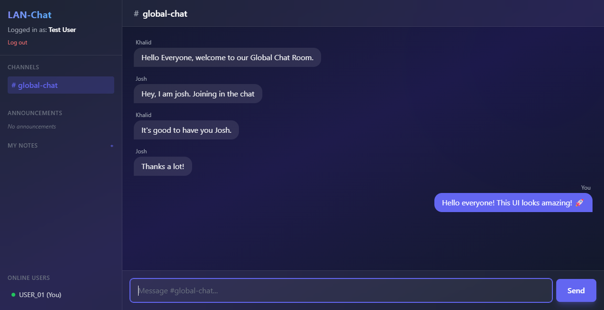
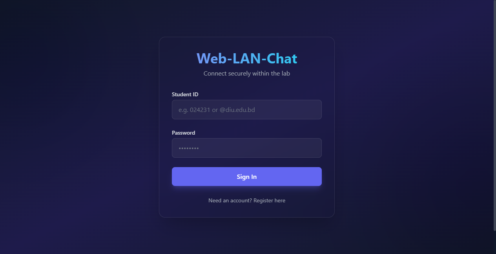

<div align="center">
  <h1>🚀 Web-LAN-Chat <br/> <sub>Software Quality Assurance (SQA) Edition</sub></h1>
  
  <p>
    A modernized, high-performance, browser-based chat application designed for Local Area Networks (LAN). Built with a strong focus on Software Quality Assurance, automated UI testing, and robust architecture.
  </p>
  
  <p>
    
    
    
    
    
  </p>
</div>

---

## 📸 Application Showcase

### Global Chat Interface (Glassmorphism UI)


### Secure Login & Authentication


---

## 🎯 Project Overview

**Web-LAN-Chat** is built to function completely offline (without internet) across a local network, making it perfect for university labs, offices, or offline events. Beyond just being a chat application, this project serves as a comprehensive demonstration of **Software Quality Assurance (SQA) best practices**.

It features a beautiful **Glassmorphism UI** built with Tailwind CSS, real-time WebSocket communication, and heavily tested backend architecture.

### ✨ Key Features
- **Real-Time Communication:** Instant messaging across the network using FastAPI WebSockets.
- **Secure Authentication:** Passwords are encrypted and hashed using `bcrypt` to ensure absolute security.
- **Persistent Chat History:** Seamlessly loads recent chat history from a local SQLite database upon joining.
- **Stunning UI/UX:** A dynamic, responsive, and animated Glassmorphism interface.
- **"Zero-Config" Deployment:** Ships with automated batch scripts for instant environment setup on any Windows machine.

---

## 🧪 Software Quality Assurance (SQA) Infrastructure

Quality is at the heart of this project. The codebase is heavily tested to ensure reliability, security, and a bug-free user experience.

- **Unit Testing (`pytest`):** Validates core backend logic, security functions (like `bcrypt` hashing algorithms), and database models in complete isolation.
- **Integration Testing (`pytest-asyncio`):** Ensures that FastAPI endpoints (Registration, Login, WebSocket handshakes) communicate flawlessly with the SQLite database.
- **Automated UI Testing (`selenium`):** A headless Chrome browser is programmatically launched to simulate real user behavior. It tests the complete end-to-end flow: toggling the registration form, filling out inputs, submitting, waiting for redirects, and successfully logging in.

### Running the Test Suite
Tests run against a temporary, isolated, in-memory database (`sqlite:///:memory:`) so your real chat data is never touched or corrupted.

1. Double-click the **`run_tests.bat`** script.
2. The script will automatically spin up the virtual environment and execute the full `pytest` suite.

---

## 🛠️ Technology Stack

| Domain | Technologies |
| :--- | :--- |
| **Backend Architecture** | Python, FastAPI, Uvicorn |
| **Frontend UI/UX** | HTML5, Vanilla JavaScript, Tailwind CSS |
| **Database & ORM** | SQLite (Serverless), SQLAlchemy |
| **Real-Time Protocol** | WebSockets |
| **SQA & Testing** | `pytest`, `pytest-asyncio`, `selenium` |

---

## 🚀 Installation & Deployment (From Scratch)

This application is designed for frictionless deployment on a brand-new Windows PC. No manual environment configuration is required.

### Prerequisites
- **Python 3.9+:** Ensure Python is installed. *(CRITICAL: Check the box "Add Python.exe to PATH" during installation).*

### Step 1: Get the Source Code
Clone the repository or download the ZIP from GitHub:
```bash
git clone https://github.com/asmkhalid111/Web-Lan-Chat.git
```

### Step 2: One-Click Server Start
1. Open the downloaded `Web-Lan-Chat` folder.
2. Double-click the **`run_server.bat`** file.
   - *What happens under the hood:* The script automatically detects your Python path, creates an isolated virtual environment (`venv`), installs all dependencies from `requirements.txt`, and boots up the FastAPI server. *(Note: The first run takes a minute to download packages. Future runs are instant).*

### Step 3: Connect and Chat!
- **Host Machine:** Open a browser and navigate to `http://localhost:8000`
- **Other Devices (Phones/Laptops on the same WiFi/LAN):** 
  1. Find your host computer's IPv4 address by typing `ipconfig` in the Command Prompt (e.g., `192.168.0.106`).
  2. Navigate to that exact IP and port on your device: `http://192.168.0.106:8000`
  *(Note: You may need to allow port 8000 through your Windows Defender Firewall).*

---
<div align="center">
  <i>Built with ❤️ focusing on modern web standards and rigorous Quality Assurance.</i>
</div>
